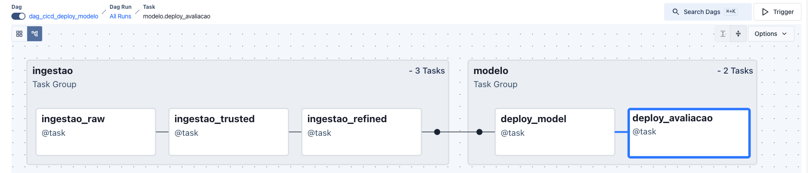

# Documentação do Projeto -- datatech-fiap-passos-magicos

## 1. Visão geral

Este projeto implementa uma API de Machine Learning com pipeline de ingestão de dados, treinamento de modelo e deploy automatizado
utilizando:

-   FastAPI para a API
-   Scikit-learn para o modelo
-   Airflow para orquestração
-   Docker para containerização
-   Testes automatizados

O objetivo principal é prever defasagem com base em dados de entrada,
expondo o modelo por meio de uma API.

------------------------------------------------------------------------

## 2. Arquitetura do projeto

    datatech-fiap-passos-magicos
    │
    ├── app/
    │   ├── main.py
    │   ├── model/
    │   │   └── modelo_defasagem.joblib
    │   └── routers/
    │       ├── ingestao_router.py
    │       └── model_router.py
    │
    ├── src/
    │   ├── api_ingestao/
    │   ├── model/
    │   ├── evaluate.py
    │   └── metrics.json
    │
    ├── notebook/
    │   └── modelo.ipynb
    │
    ├── docker-composer/
    │   ├── dags/
    │   ├── config/
    │   └── docker-compose.yaml
    │
    ├── tests/
    │   ├── test_api.py
    │   └── testes.csv
    │
    ├── Dockerfile
    ├── requirements.txt
    └── README.md

------------------------------------------------------------------------

## 3. Fluxo geral do sistema

1.  Ingestão de dados
2.  Treinamento do modelo
3.  Avaliação do modelo
4.  Deploy via Airflow
5.  API para predição

------------------------------------------------------------------------

## 4. API 

[Documentação API](app/README.md)

### Endpoint principal

    POST /predict

### Exemplo de requisição

``` json
{
  "feature_1": 10,
  "feature_2": 5
}
```

### Resposta

``` json
{
  "prediction": 1
}
```

------------------------------------------------------------------------

## 5. Treinamento do modelo

Arquivo principal:

    src/model/build_model.py

Responsável por: - Carregar dataset - Treinar modelo de ML - Salvar
modelo com joblib

Saída:

    app/model/modelo_defasagem.joblib

------------------------------------------------------------------------

## 6. Avaliação do modelo

Arquivo:

    src/evaluate.py

Gera métricas como: - Accuracy - Precision - Recall - F1-score

Resultado:

    src/metrics.json

------------------------------------------------------------------------

## 7. Orquestração com Airflow

[Documentação ambiente](docker-composer/README.md)

Local:

    docker-composer/

DAG principal:

    dag_cicd_deploy_modelo.py

Função: 1. Ingestão 2. Treinamento 3. Avaliação 4. Deploy

------------------------------------------------------------------------

## 8. Docker

### Build

    docker build -t api-defasagem .

### Run

    docker run -p 8000:8000 api-defasagem

Acessar: - http://localhost:8000 - http://localhost:8000/docs

------------------------------------------------------------------------

## 9. Testes automatizados

Executar:

    pytest tests/

------------------------------------------------------------------------

## 10. Dependências

Instalar:

    pip install -r requirements.txt

Principais libs: - fastapi - uvicorn - scikit-learn - pandas - joblib -
pytest

------------------------------------------------------------------------

## 11. Execução local

### Rodar API

    uvicorn app.main:app --reload

Acessar:

    http://localhost:8000/docs

### Treinar modelo

    python src/model/build_model.py

### Avaliar modelo

    python src/evaluate.py

------------------------------------------------------------------------

